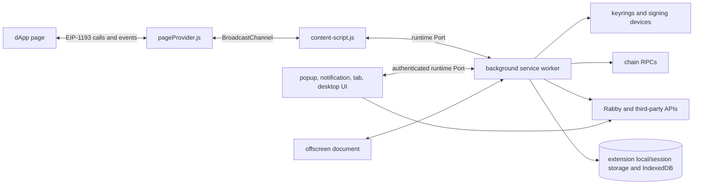

# Runtime architecture

This document describes the current source tree. It is a guide for extension work, not a security audit. The older [background notes](./background.md) describe the original MV2 design, where UI code could obtain the background window directly. The current MV3 build uses a service worker and an RPC bridge for every UI surface.

## The processes and trust boundaries

The page provider runs in the web page's JavaScript world. The content script runs in the extension's isolated world and relays messages. The background owns wallet authority: permissions, selected accounts, approvals, keyrings, signing, transaction tracking, API clients, and persisted stores. React UIs ask the background to act; they do not own keys or authoritative wallet state.

The MV3 manifest makes `sw.js` the service worker, injects the content script in every frame at `document_start`, and exposes only `pageProvider.js` to pages ([manifest](../src/manifest/chrome-mv3/manifest.json#L30)). Webpack builds separate background, content-script, page-provider, UI, and offscreen entry bundles ([webpack config](../build/webpack.common.config.js#L64)). The same repository still produces MV2 variants, so lifecycle assumptions must follow the selected manifest rather than the old prose docs.

## Entry points and contexts

| Context | Entry point | Job |
| --- | --- | --- |
| Background | [`src/background/index.ts`](../src/background/index.ts#L163) | Restores state, initializes services, exposes the UI and page-provider RPC endpoints, runs watchers and alarms. |
| Page provider | [`src/content-script/page-provider.ts`](../src/content-script/page-provider.ts#L1) | Loads `@rabby-wallet/page-provider`, which supplies the dApp-facing EIP-1193 provider. |
| Content script | [`src/content-script/index.ts`](../src/content-script/index.ts#L24) | Injects the provider and bridges its BroadcastChannel to an extension runtime port. It reconnects after service-worker suspension. |
| Extension UI | [`src/ui/index.tsx`](../src/ui/index.tsx#L1) | Boots the React app used by popup, notification, tab, and desktop routes. |
| UI wallet client | [`src/ui/wallet/createWallet.ts`](../src/ui/wallet/createWallet.ts#L85) | Creates a proxy whose methods become background `controller` requests. It queues calls until the background announces readiness and reconnects with backoff. |
| Offscreen document | [`src/offscreen/scripts/offscreen.ts`](../src/offscreen/scripts/offscreen.ts) | Hosts browser APIs and hardware integrations that cannot run reliably in an MV3 service worker. |

The `desktop` name means an extension tab with a larger React route, not a separate native process. The background accepts UI ports named `popup`, `notification`, `tab`, and `desktop`, and verifies that they came from this extension before exposing the wallet controller ([background port routing](../src/background/index.ts#L443)). This is the key difference from the historic direct-background-window model.

## Startup and ownership

`restoreAppState()` loads the serialized keyring state, subscribes future keyring changes to local storage, initializes the OpenAPI runtime, runs migrations, then initializes each background service in a fixed order ([startup](../src/background/index.ts#L163)). Only after that does it set `appStoreLoaded` and emit the background-ready event ([ready transition](../src/background/index.ts#L204)). UI clients wait for `BACKGROUND_READY_MESSAGE`, so a restarted MV3 worker can rebuild authoritative state before queued UI calls run ([UI reconnect protocol](../src/ui/wallet/createWallet.ts#L102)).

There are two controller families:

- `walletController` is the extension UI API. The UI proxy sends method names and parameters over a named runtime port. Background dispatch checks that the property is a function before calling it ([UI dispatch](../src/background/index.ts#L458)).
- `providerController` is the dApp JSON-RPC API. It chooses the account for the origin, handles internal methods, verifies a vault exists, then enters `rpcFlow` ([provider entry](../src/background/controller/provider/index.ts#L23)).

Background services hold domain state and reusable logic. Controllers coordinate those services for a request. This split is useful when adding features: UI rendering belongs under `src/ui`, authority and durable state belong in a background service, and the wallet controller exposes the smallest UI-facing operation needed.

## dApp request and signing flow

1. A dApp calls the injected provider. `pageProvider.js` sends the request over the `rabby-content-script` BroadcastChannel. The content script forwards it through `PortMessage` ([content bridge](../src/content-script/index.ts#L42)).
2. The background derives the origin from `port.sender.url`, associates a session with `tabId + origin`, removes untrusted `$ctx` fields, and calls `providerController` ([page-provider routing](../src/background/index.ts#L581)). Sessions are in-memory objects that also retain page ports for provider events ([session service](../src/background/service/session.ts#L47)).
3. `rpcFlow` maps the RPC method, rejects private or missing handlers, checks lock state, asks for an unlock when required, and asks the user to connect an unapproved origin ([lock and connect middleware](../src/background/controller/provider/rpcFlow.ts#L70)). Decorator metadata on provider methods declares whether a method is safe and which approval component it needs. For example, `personalSign` declares `SignText` and checks that `from` matches the selected account ([personal signing handler](../src/background/controller/provider/controller.ts#L1461)).
4. For an approval method, the flow builds approval data with origin, method, payload, and account, then awaits `notificationService.requestApproval()` ([approval creation](../src/background/controller/provider/rpcFlow.ts#L335)). The notification service keeps a current approval plus a queue and opens or focuses the notification UI ([approval state](../src/background/service/notification.ts#L127)).
5. The approval React component binds itself to both the approval id and component. Resolve and reject calls re-read the current approval and send that binding to `resolveApprovalFor` or `rejectApprovalFor` ([bound UI hook](../src/ui/utils/hooks.ts#L55)). This binding is part of the wallet's consent boundary. A feature must never resolve whichever approval happens to be current.
6. The approved result returns to `rpcFlow`, which calls the mapped provider method with `approvalRes` ([execution handoff](../src/background/controller/provider/rpcFlow.ts#L410)). Transaction and message handlers select the account's keyring and call the keyring service. The service normalizes the address and delegates to software, hardware, WalletConnect, Safe, or other keyring implementations ([keyring transaction signing](../src/background/service/keyring/index.ts#L910)). The result travels back through the runtime port, content bridge, and provider promise.

Transaction signing is more than a raw keyring call. The controller retrieves the cached transaction that the approval UI inspected, pins the broadcast chain to the approved chain id, signs it, records history, and submits or watches the transaction ([transaction signing path](../src/background/controller/provider/controller.ts#L860)). Read that path and [`src/ui/views/Approval/components/SignTx.tsx`](../src/ui/views/Approval/components/SignTx.tsx) together before changing transaction behavior. The value shown to the user and the payload sent to the keyring must remain the same request.

## UI and background state

The UI is a React application with route-dependent layouts for popup, notification, tab, and desktop. Its wallet object is an RPC proxy, so a call such as `wallet.getCurrentAccount()` is remote even though it looks local ([proxy creation](../src/ui/wallet/createWallet.ts#L130)). Background broadcasts are delivered to every connected UI port ([broadcast fan-out](../src/background/index.ts#L511)). Treat them as state notifications, not proof that the user acted in a particular window.

UI state uses Zustand stores and background-store adapters. The background remains authoritative. `createPersistStore` loads a named object from `browser.storage.local`, validates it when a schema exists, persists patches, and broadcasts permitted changed keys with a revision ([persistence helper](../src/background/utils/persistStore.ts#L196)). A service may restrict broadcasts with `broadcastKeys`; the OpenAPI store uses this to expose only public settings ([OpenAPI store](../src/background/service/openapi.ts#L25)).

Storage falls into four practical classes:

| Lifetime | Mechanism | Examples |
| --- | --- | --- |
| Durable extension data | `browser.storage.local` | preferences, permissions, service stores, encrypted keyring state ([storage wrapper](../src/background/webapi/storage.ts#L5)). |
| Worker-lifetime state | module memory | approval queue, current approval, dApp sessions, live ports. It disappears when an MV3 worker is terminated. |
| Browser-session data | `browser.storage.session` | auto-lock deadline and page-state cache. |
| Larger portfolio/cache data | IndexedDB through `src/db` | token, balance, DeFi, NFT, and app-chain synchronization data. |

The keyring state is special. Startup loads `keyringState` before migrations and subscribes serialized changes back to storage ([keyring restore](../src/background/index.ts#L163)). The keyring service selects implementations for private keys, mnemonics, hardware wallets, WalletConnect, Safe and custodial integrations. Private material stays behind this service; feature code should pass an account and a signing intent through an existing controller path instead of reading keyring storage.

## Network and data services

On-chain reads and broadcasts use chain RPC selection in `RPCService` and provider-controller helpers. Rabby's portfolio, transaction explanation, security, swap, bridge, gas, points, and related data use API clients. Both the background and each extension UI context create their own OpenAPI runtime. The background persists the endpoint and API identity; UI runtimes hydrate and synchronize its public configuration through the wallet bridge ([background runtime](../src/background/service/openapi.ts), [UI runtime](../src/ui/wallet/index.ts), [shared lifecycle](../src/services/openapi/createOpenapiRuntime.ts)). Consequently, a `wallet.openapi` call can execute in the UI context, while ordinary wallet-controller calls cross into the background.

For a portfolio feature, start with the existing `src/db`, `syncDbService`, and wallet-controller balance/portfolio methods. Startup and transaction-complete handlers already expire balance, token, DeFi, NFT, and app-chain scenes so the next query refreshes stale data ([cache invalidation](../src/background/index.ts#L233)). Add a new persisted background service only for genuinely new user-owned state. Derived view state belongs in a UI store, while fetched entity caches should follow the existing database sync model.

## Forking rules that prevent expensive mistakes

These are recommendations based on the boundaries above:

- Put privileged behavior behind a background controller method. Validate origin, account, chain, and payload again at that boundary.
- Treat lock, unlock, account switch, chain switch, disconnect, and service-worker restart as session boundaries. Reject or re-confirm any pending consent across them.
- Bind every approval settlement to both `approvalId` and `approvalComponent`. Keep signing fail-closed when an approval result is absent or malformed.
- Assume a `broadcastToUI` event reaches popup, notification, tab, and desktop. A listener may update state, but it cannot infer local user consent.
- Do not add a dApp RPC method by exposing a wallet-controller method. Add it to provider routing, assign explicit `SAFE`, `PRIVATE`, or `APPROVAL` metadata, and trace it to its authority checks.
- Expect MV3 suspension. Persist state that must survive restart, rebuild subscriptions on reconnect, and never rely on an in-memory timer or queue for durable correctness.

## Glossary

| Term | Meaning here |
| --- | --- |
| Page provider | The dApp-visible EIP-1193 provider running in the page world. |
| Content script | Isolated extension code that relays page-provider messages to background. |
| Wallet controller | RPC API for Rabby's own React UI. |
| Provider controller | RPC API for dApps, with permission and approval middleware. |
| Service | Background-owned state or domain logic used by controllers. |
| Approval | A queued request for a specific React approval component and user decision. |
| Session | In-memory `tabId + origin` metadata and ports for a dApp connection. |
| Keyring | An account/signing implementation, including software and external devices. |
| OpenAPI | Rabby's backend API client, separate from Ethereum chain JSON-RPC. |
