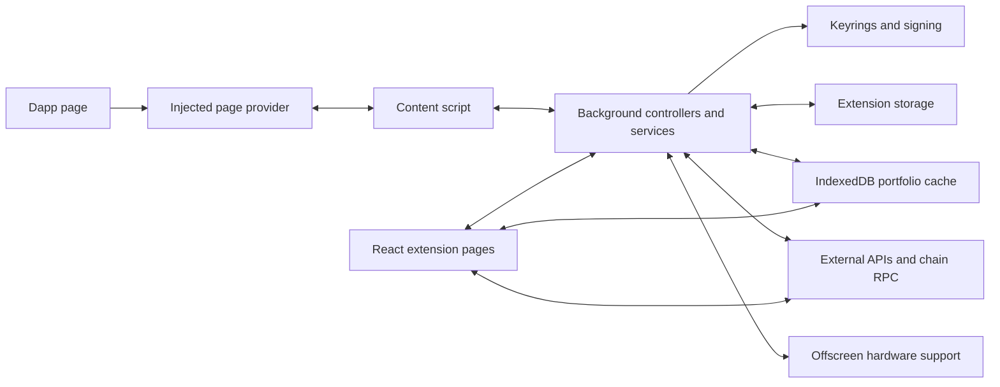

# Rabby developer guide

This guide describes checkout `66c312834b2706232adb9a1b1a67b9eb7644f9a8`, package version `0.94.9`. It is an explanation of the source in this checkout, not a claim about the latest upstream release. The linked implementation files are the primary sources.

Rabby is a TypeScript browser extension with a React interface. It contains the wallet client, its signing and approval machinery, and portfolio screens. Portfolio aggregation and several transaction services depend on external APIs. This repository does not contain the backend implementation behind those APIs. See the [package](../package.json), [extension manifest](../src/manifest/chrome-mv3/manifest.json), and [API client factory](../src/services/openapi/createOpenapiClient.ts).

## Reading order

| Guide | What you will learn |
| --- | --- |
| This page | Stack, directory map, and the main design choices |
| [Runtime architecture](architecture-runtime.md) | Execution contexts, message flow, approvals, signing, and storage |
| [Build and development](build-and-development.md) | Setup, browser targets, build outputs, checks, and what was verified locally |
| [Wallet smoke test](wallet-smoke-test.md) | Executed development baseline, resource limits, and the manual account/testnet checklist |
| [Account portfolios plan](portfolio-implementation-plan.md) | Folder behavior, storage model, UI, implementation sequence, and acceptance tests |
| [Test the fork beside Rabby](testing-portfolio-dev.md) | Install the named development build, connect both wallets, and rebuild it |
| [Portfolio verification](portfolio-verification.md) | Automated checks, browser scenarios, screenshots, and remaining test limits |
| [Fork and portfolio options](fork-and-portfolio.md) | Where to add features, what can be reused, and what a separate portfolio app needs |

## Stack at a glance

Versions below are declared in [package.json](../package.json), not recommendations to upgrade or downgrade.

| Area | Technology | Role |
| --- | --- | --- |
| Language | TypeScript 5.3.3 | UI, background controllers, services, and shared types |
| Interface | React 18.3.1, React Router 5.3.4 | Extension screens and hash-based navigation |
| Styling | Ant Design 4.24.16, Tailwind 4.3.0, Less, styled-components 5.3.5 | Existing components, utility classes, and theme styles |
| UI state | Zustand 5.0.14 | Client state and synchronized background-backed stores |
| Server state | TanStack Query 5.102.2 | Refetchable data owned by a UI window |
| Local database | Dexie 4.3.0 over IndexedDB | Cached portfolio data and history |
| Ethereum | ethers 5.8.0, viem 2.47.6, EthereumJS, Rabby/MetaMask-derived keyrings | RPC, transaction types, signing, and account implementations |
| API integration | `@rabby-wallet/rabby-api` 0.9.67 | Rabby API client with a fetch adapter and web-sign plugin |
| Bundling | Webpack 5.76.0, ts-loader | Separate bundles for extension contexts |
| Toolchain | Node >=22, Yarn 4.14.1 | Installation and scripts |
| Checks | ESLint 8.57.0, TypeScript, Jest 29.7.0 | Lint, type checks, and automated tests |

The current [store facade](../src/ui/store.ts) combines Zustand stores. Names such as `useRabbyDispatch`, `useRabbySelector`, and `connectStore` preserve older calling conventions; they do not establish that Redux or Rematch still runs underneath them. The [query-layer README](../src/ui/query/README.md) still mentions Rematch, so follow the implementation when those descriptions differ.

## How the pieces fit

These boxes represent separate execution contexts or responsibilities, not one React application sharing a global object. The [manifest](../src/manifest/chrome-mv3/manifest.json) declares the service worker and content scripts. The [background entry](../src/background/index.ts) restores services and handles communication. The [UI wallet client](../src/ui/wallet/index.ts) bridges controller calls and also constructs a UI-local API runtime. The [database](../src/db/index.ts) stores portfolio caches, and [offscreen code](../src/offscreen/scripts/offscreen.ts) supports work that needs a document context.

A new display feature often needs only a view, a hook or query, and existing data services. A signing feature reaches across the UI, approval lifecycle, provider controller, and keyrings. Treat those as different sizes of change.

## Directory map

| Path | Responsibility | When you would edit it |
| --- | --- | --- |
| [`src/ui/views/`](../src/ui/views/) | Screens, routes, dashboard, approvals, desktop layout | Add a screen or change a user flow |
| [`src/ui/component/`](../src/ui/component/) | Shared UI components | Reuse or extend a visual element |
| [`src/ui/hooks/`](../src/ui/hooks/) | UI behavior and data access hooks | Connect a view to existing behavior |
| [`src/ui/state/`](../src/ui/state/) | Zustand stores and synchronization infrastructure | Add client state or expose background state |
| [`src/ui/query/`](../src/ui/query/) | Query keys, client defaults, resource definitions | Add retry-safe server reads |
| [`src/ui/wallet/`](../src/ui/wallet/) | UI-to-background client and API namespace | Understand how UI calls wallet operations |
| [`src/background/controller/`](../src/background/controller/) | Wallet controller and dapp provider handlers | Expose a wallet operation or handle an RPC method |
| [`src/background/service/`](../src/background/service/) | Wallet services, permissions, notifications, keyrings, transactions | Change authoritative wallet behavior |
| [`src/background/webapi/`](../src/background/webapi/) | Browser storage, tabs, windows, notifications | Change browser integration |
| [`src/content-script/`](../src/content-script/) | Dapp bridge and provider injection | Change website integration |
| [`src/offscreen/`](../src/offscreen/) | Document context for hardware integrations | Work on an affected hardware path |
| [`src/services/openapi/`](../src/services/openapi/) | API construction and runtime setup | Understand remote-data coupling |
| [`src/db/`](../src/db/) | Dexie schema, cache services, synchronization | Change portfolio cache shape or refresh behavior |
| [`src/migrations/`](../src/migrations/) | Stored extension data migrations | Change existing users' persisted data |
| [`src/constant/`](../src/constant/) and [`src/utils/`](../src/utils/) | Shared definitions and utilities | Locate chain definitions, events, environment flags, and helpers |
| [`src/manifest/`](../src/manifest/) | Browser permissions and target manifests | Change extension metadata or browser capabilities |
| [`_raw/`](../_raw/) | Copied assets and translations | Update branding or locale text |
| [`build/`](../build/) and [`scripts/`](../scripts/) | Bundling, themes, development server, release helpers | Change how the extension is assembled |
| [`patches/`](../patches/) | Dependency modifications applied during installation | Understand behavior that differs from published packages |
| [`__tests__/`](../__tests__/) | Automated tests | Find examples and test a changed behavior |
| [`skills/`](../skills/) | Repository-specific contributor instructions | Check the workflow for the area you change |

Imports such as `@/db`, `ui/utils`, `background/controller/wallet`, and `consts` use the aliases in [tsconfig.json](../tsconfig.json).

## State ownership matters

The background services own wallet state. UI stores provide a local view of that state and send changes back through the wallet bridge. Portfolio data also has a Dexie cache, while TanStack Query holds selected refetchable data in each UI window. These stores have different lifetimes and purposes. See [background initialization](../src/background/index.ts), [synchronized storage](../src/ui/state/createStore/createSyncedBackgroundStorage.ts), [Dexie schemas](../src/db/schema/index.ts), and [query rules](../src/ui/query/README.md).

For a new feature, first find the existing owner of its data. Do not introduce another cache for data already managed by Dexie. Do not store signing approval or unlock consent in a query cache. For background-persisted UI state, follow the repository's [store skill](../skills/rabby-create-store/SKILL.md).

## A practical first pass through the code

1. Read [package.json](../package.json) and [Webpack common configuration](../build/webpack.common.config.js) to see how one repository becomes several scripts and HTML pages.
2. Read [UI startup](../src/ui/app.tsx), [route selection](../src/ui/views/index.tsx), and [Dashboard](../src/ui/views/Dashboard/) to find the visible application.
3. Follow a UI call through [the wallet client](../src/ui/wallet/index.ts) to [the wallet controller](../src/background/controller/wallet.ts).
4. Read [background startup](../src/background/index.ts) to see initialization, restoration, and message routing.
5. Follow the request walkthrough in [the runtime guide](architecture-runtime.md), then inspect the linked approval and signing code.
6. For portfolio work, follow one token or balance read through [the portfolio guide](fork-and-portfolio.md) before changing its UI.

The root README and older `background.md`, `content-script.md`, and `ui.md` are useful historical introductions. Their references to direct background-window access do not fully describe this checkout's current message bridge. Use these new guides and linked source for current behavior.

## Choosing your starting point

If the new functionality changes the wallet experience, build the extension and add it beside the closest existing feature. If your main goal is aggregating addresses, holdings, and performance in a separate app, start by evaluating a read-only portfolio design. It can reuse data shapes and display logic without taking responsibility for private keys and signing. The [fork and portfolio guide](fork-and-portfolio.md) explains the extraction work and backend dependency decisions; a separate app is a proposal, not something this repository already builds.

Changes to signing must preserve the [wallet security invariants](../AGENTS.md). In particular, session boundaries invalidate consent, approval completion must identify the exact request and component, and a missing approval result must reject signing. This documentation task is not a security audit or a certification of the existing implementation.

Before republishing, read the actual [LICENSE](../LICENSE), including its brand-name and logo restriction. Build success also does not establish access rights or continued availability for remote APIs.
