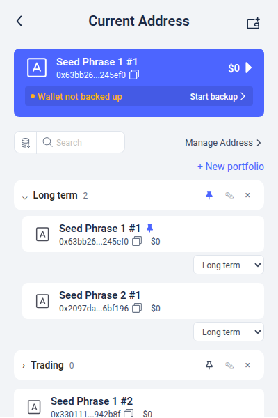
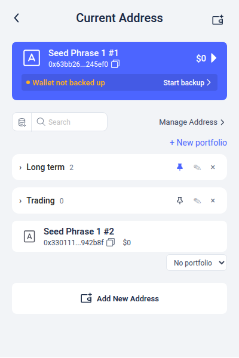
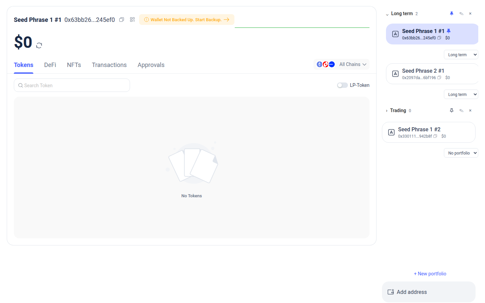
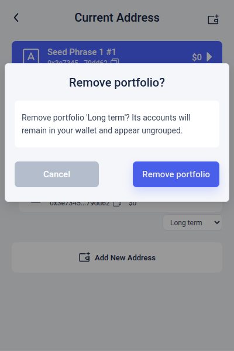

# Account portfolio verification

This feature adds named folders to the popup and desktop account lists. Create a portfolio, use the selector below an account to move it into the folder, and click the folder header to expand or collapse it. Folder pins and existing account pins are independent. Removing a folder returns its accounts to the ungrouped list.

Membership uses the normalized address, so wallet records for the same address share a folder while retaining their original signing identity. Portfolio metadata is stored locally in `accountPortfolios`; recovering a seed alone does not recover folder organization.

## Automated checks

Run on 2026-09-20, sequentially under hard memory limits:

| Check | Result |
| --- | --- |
| `corepack yarn` | Passed using Yarn 4.14.1; dependency files unchanged |
| `corepack yarn check` | Passed repository-wide ESLint and TypeScript checks |
| Focused regression run | 10 suites, 63 tests passed |
| Expanded service test run | 14 tests passed, including 5 additional concurrency/failure cases |
| Chrome MV3 development build | Passed; two existing dynamic-dependency warnings in `ox/tempo` |
| Sol code/security review | No remaining feature-scoped blockers after corrections |

The regression command used `node node_modules/jest/bin/jest.js --runInBand` with these paths:

```text
__tests__/service/accountPortfolios.test.ts
__tests__/utils/persistStore.test.ts
__tests__/ui/accountPortfolios.test.ts
__tests__/ui/accountPortfoliosStore.test.ts
__tests__/ui/initializeBizStores.test.ts
__tests__/background/walletBoot.test.ts
__tests__/background/approvalSigning.test.ts
__tests__/ui/unlockApproval.test.ts
__tests__/ui/accountToDisplayStore.test.ts
__tests__/ui/walletStatusStore.test.ts
```

The expanded service suite was run separately after adding the extra cases. The runs cover 68 distinct tests in total. Jest ran with one worker, a 4 GiB container cap, and a 2.5 GiB Node heap. The build used the command documented in [wallet smoke test](wallet-smoke-test.md#resource-limits-for-this-host), with a 7 GiB container cap, no swap, and a 5 GiB Node heap. The build and tests never ran concurrently.

Service tests cover normalized exclusive membership, stale moves, independent concurrent edits, validation, last-record cleanup, lock races, malformed data, and reset/save failures. Persistence tests verify that failed writes do not change memory, revision, or broadcasts. UI tests cover grouping, ordering, search, command-only writes, hydration, and reconnect recovery. All 15 locale files contain the new labels with matching placeholders.

## Browser checks

Chromium 151.0.7922.34 loads the unpacked extension in a disposable profile. Three unfunded accounts were created through the UI: two under one seed and one under another. No seed or private key was exported.

The browser driver checks state through the existing extension controller port and exercises folder actions through the UI. Popup layout uses a 400 × 600 viewport; desktop uses 1440 × 900.

| Scenario | Result |
| --- | --- |
| Original account list before creating folders | Passed |
| Create named folders and assign accounts from both seeds | Passed |
| Folder pin and existing account pin | Passed; independent persisted values |
| Collapse/expand | Passed; hidden child rows and unchanged current selection |
| Search and clear | Passed; matching parent expands, then prior collapse state returns |
| Move a pinned account | Passed; exclusive membership and account pin retained |
| Rename and remove in two open windows | Passed; other window reflects changes |
| Remove populated folder | Passed; members become ungrouped and accounts, pins, current selection remain identical |
| Click a grouped account | Passed; existing switch flow selects it and opens dashboard |
| Lock/unlock | Passed; metadata and selection preserved |
| Full browser restart | Passed; opens locked, then restores accounts, folders, membership, both pin types, and current selection |
| Keyboard Space/Enter on folder | Passed; collapses/expands |
| Remove last folder | Passed; original list returns, preserving aliases, accounts, pins, and selection |
| Desktop synchronization | Passed; folder removal updates desktop list |
| Uncaught page errors | None observed across either browser session |

The first visual check found a clipped move selector and crowded toolbar at popup width. The corrected UI gives the selector a separate footer, removes duplicate account padding, and places the create action below the existing toolbar. The final screenshots were captured after rebuilding these corrections. The browser run completed 26 explicit assertions.

## Screenshots

Captured from the built extension with disposable accounts:

| Expanded folder | Collapsed folders |
| --- | --- |
|  |  |





## Limits

The development bundle was tested as an unpacked Chrome MV3 extension with `popup.html` opened as a tab. Browser-toolbar popup focus/close behavior and Firefox were not tested. The test profile was discarded after verification. Production minification/Warden, hardware devices, and funded transactions need separate validation. The earlier baseline keyring Jest suite fails at Ledger dependency resolution; see [wallet smoke test](wallet-smoke-test.md).
