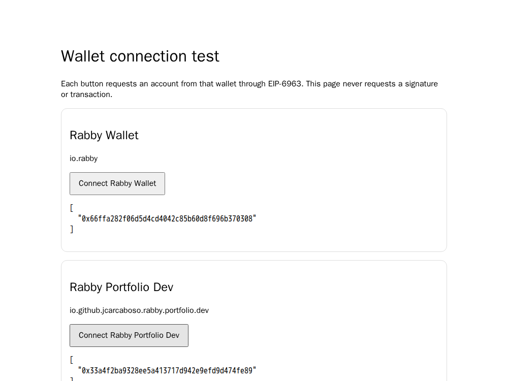

# Test Rabby Portfolio Dev beside Rabby

Use the `portfolio-dev` build to keep the fork separate from your installed Rabby. Its browser name is **Rabby Portfolio Dev** and its stable extension ID is `hlbmgggeeglchnhanhcopmnnlfmpnnlg`. The checked-in key is public identification material, not a wallet key. Keep it unchanged between builds so the browser preserves this extension's storage.

## Load the prepared package

1. Extract `rabby-portfolio-dev.zip` into a permanent folder on your computer.
2. Open `chrome://extensions` in Chrome or `brave://extensions` in Brave and enable **Developer mode**.
3. Click **Load unpacked** and select the extracted `dist-portfolio-dev` folder containing `manifest.json`.
4. Check that the extension is named **Rabby Portfolio Dev** and has the ID above. Keep official Rabby installed.
5. Pin the fork in the extensions menu. Hover over the icon to see its name; this build retains Rabby's rabbit artwork.
6. Create a fresh test wallet in the fork, then open its account list and use **+ New portfolio**. Test grouping accounts from two seeds, pinning, collapse/expand, moving, and removing folders.

The wallets have separate storage, passwords, and accounts. Your installed Rabby's accounts do not automatically appear in the fork. Use disposable accounts for this development build.

To update, replace the files inside the same extracted directory and click **Reload** on the fork's card. Do not remove/reinstall it as an update method: removing an extension deletes its local data. Reload dapp tabs after updating injected-provider code.

Chrome's [unpacked extension instructions](https://developer.chrome.com/docs/extensions/get-started/tutorial/hello-world#load-unpacked) and [manifest key documentation](https://developer.chrome.com/docs/extensions/reference/manifest/key) explain the installation and stable ID.

## Connect both wallets to a dapp

On a dapp with an [EIP-6963 wallet picker](https://eips.ethereum.org/EIPS/eip-6963), choose **Rabby Portfolio Dev** for the fork or **Rabby Wallet** for official Rabby. The fork announces `io.github.jcarcaboso.rabby.portfolio.dev` and uses separate page/content-script channels. It does not claim `window.ethereum`, `window.rabby`, or `window.web3`; official Rabby keeps those legacy entry points. Sites with only a legacy single-wallet connector cannot select the fork in this shared-profile setup.

The fork also leaves `go.rabby.io` navigation to official Rabby. Open the fork's desktop view from its own extension UI. Avoid enabling its MetaMask compatibility mode during this test; select its named EIP-6963 entry directly.

For a local connection test, from the repository root run:

```sh
python3 -m http.server 8765 --bind 127.0.0.1 --directory scripts/fixtures
```

Visit `http://127.0.0.1:8765/wallet-discovery.html`, with both wallets unlocked and using different test accounts. Both names should appear. Connect each separately and verify that the matching extension prompts and returns its own account. The page requests no signature or transaction.

## Build it again

After installing the repository's Yarn dependencies:

```sh
yarn build:portfolio-dev
```

This builds once into `dist-portfolio-dev/` with a 5 GiB Node heap and no source maps. The normal build and its `dist/` directory are unchanged. The build ignores `manifest.local.json` and applies the fork identity only in this mode. The provider-package namespace transform fails if its expected source changes, requiring review after dependency updates.

On the shared development host, use the hard container memory cap as well. Run each command after the previous one exits:

```sh
node scripts/checks/portfolio-dev-build.cjs
node scripts/make-theme.js
rabby_git_dir="$(git rev-parse --path-format=absolute --git-common-dir)"
docker run --rm --name rabby-portfolio-dev-build \
  --memory=7g --memory-swap=7g --cpus=2 \
  -v "${PWD}:/workspace" \
  -v "${rabby_git_dir}:${rabby_git_dir}:ro" \
  -w /workspace -e MANIFEST_TYPE=chrome-mv3 \
  -e NODE_OPTIONS=--max-old-space-size=5120 \
  --entrypoint node homelab/jenkins-dashboard-browser-tests:1.62.0 \
  node_modules/webpack/bin/webpack.js --env config=portfolio-dev --stats errors-warnings
python3 -m zipfile -c tmp/rabby-portfolio-dev.zip dist-portfolio-dev
```

The Docker image is already present on this host; it is not a public prerequisite. On another machine, use the Yarn command and an equivalent process/container memory limit. Do not run tests, builds, and browsers concurrently on this host.

## Verification

Verified on 2026-09-21:

- `corepack yarn` and `corepack yarn check` passed.
- `node scripts/checks/portfolio-dev-build.cjs` passed. A focused compile verified all four renamed HTML templates.
- The complete Chrome MV3 development build passed under a 7 GiB cap, with the two existing `ox/tempo` dynamic-dependency warnings.
- Chromium 151 loaded the fork alongside this checkout's normal Rabby development build, using the official Rabby extension ID for the latter. This was not a downloaded Chrome Web Store binary.
- Twelve browser assertions passed: distinct extension IDs, accounts, discovery entries, and page globals; each Connect action opened only its matching extension; each returned its own account; reload and reconnect preserved separation; portfolio creation worked and did not alter the other wallet's metadata.
- No uncaught page errors were observed. Both disposable test profiles/wallets were discarded with the browser container. No seed export, signature, transaction, or funded account was used.



This is an unpacked development build, not a production release or store submission. Actual Chrome Web Store Rabby, Brave, hardware wallets, signing/sending, and all possible dapp connectors still require their own checks.
